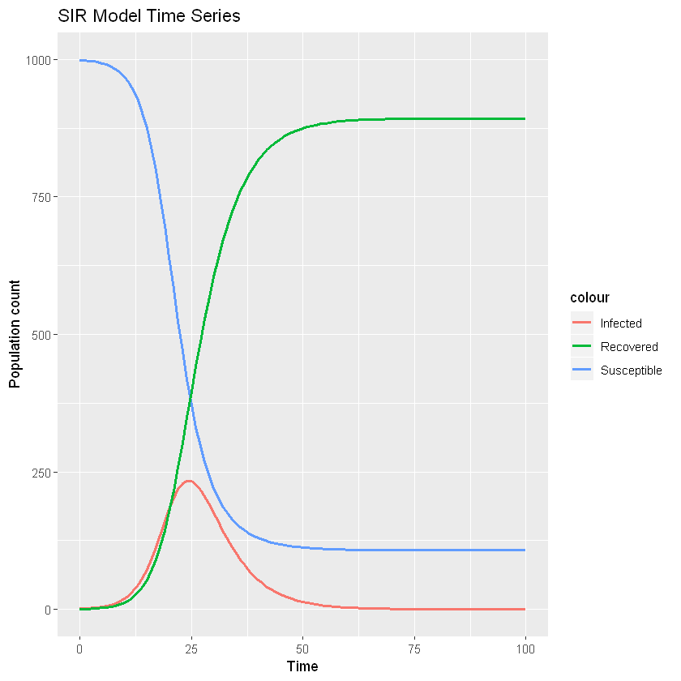

# covid-19
Source files for COVID-19 project for Math 699 Stochastic Processes, Spring 2020


```R
library("deSolve")
library("ggplot2")
```

    Warning message:
    "package 'deSolve' was built under R version 3.6.3"
    


```R
#Define ODE system
f <- function(t, y, parms) {
  S = y[1]
  I = y[2]
  R = y[3]
  
  beta = parms[1]
  gamma = parms[2]
  
  dS = -beta*S*I/N
  dI = beta*S*I/N - gamma*I
  dR = gamma*I

  return(list(c(dS, dI, dR)))
}
```


```R
# Initial condition
N = 1000
S0 = 999
I0 = 1
R0 = 0
x0 = c(S=S0, I=I0, R=R0)
```


```R
# Parameters
beta=1/2
gamma=1/5
mu = c(beta, gamma)
```


```R
# Time interval
t_max = 100
t_eval <- seq(0,t_max)
```


```R
# Run Runge-Kutta algorithm to solve ODE
soln = rk4(y=x0, times=t_eval, func=f, parms=mu)
```


```R
# Plot results
ggplot(data.frame(soln), aes(x=time)) + 
  labs(title='SIR Model Time Series', x='Time', y='Population count') +
  geom_line(aes(y=S, col='Susceptible'), size=1) +
  geom_line(aes(y=I, col='Infected'), size=1) +
  geom_line(aes(y=R, col='Recovered'), size=1)
```




